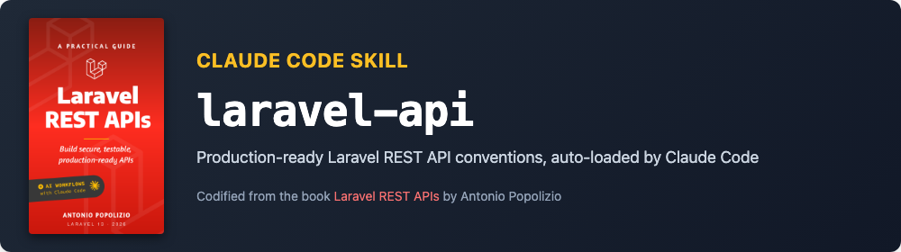

# claude-code-laravel-api



A standalone [Claude Code](https://claude.com/claude-code) skill that codifies REST API conventions for Laravel. Drop it into `.claude/skills/`, and Claude Code will scaffold and modify controllers, form requests, API resources, policies, migrations, factories, seeders, and Pest tests following these conventions.

**Anyone can use it**: you don't need to have read the book it originates from. The book ([*Laravel REST APIs: A Practical Guide*](https://antonio.popolizio.it/laravel-rest-apis)) explains the reasoning behind the rules; the skill works on its own. A reference implementation lives in the companion project [BookShelf](https://github.com/gitantonio/bookshelf).

## Compatibility

- **Laravel** 13+
- **PHP** 8.3+
- **Claude Code** (any recent version that supports skills)

## What is a Claude Code skill

A skill is a Markdown file (with YAML frontmatter) that Claude Code loads as additional context when the description matches what you're asking for. Skills are particularly useful to codify project-specific conventions that Claude Code cannot infer from a generic knowledge base.

This repository provides a single skill, `laravel-api`, whose description triggers when you ask Claude Code to create or modify API resources in a Laravel project.

## Installation

Clone the repository somewhere on your machine:

```bash
git clone https://github.com/gitantonio/claude-code-laravel-api.git
```

Then make the skill available to Claude Code. You have two options.

### Option 1: per project

Copy (or symlink) the `laravel-api/` folder into `.claude/skills/` of the project where you want to use it:

```bash
mkdir -p /path/to/your/laravel-project/.claude/skills
ln -s /path/to/claude-code-laravel-api/laravel-api \
      /path/to/your/laravel-project/.claude/skills/laravel-api
```

### Option 2: globally

Place the skill in your user-level Claude Code configuration so it's available in every project:

```bash
mkdir -p ~/.claude/skills
ln -s /path/to/claude-code-laravel-api/laravel-api \
      ~/.claude/skills/laravel-api
```

Restart Claude Code (or start a new session) and the skill will be listed among the available skills.

## Usage

Claude Code activates the skill automatically when what you ask matches its description. No manual invocation needed. Example prompts:

```
> Add an Invoice resource with number, amount, due date and an optional note
> Add soft deletes to Project and expose a restore endpoint
> Review StoreContactRequest and make sure it follows our conventions
```

To confirm the skill is loaded, run `/skills` in Claude Code: `laravel-api` should appear in the list.

## What the skill covers

**Data layer**
- Model with explicit `$fillable`, relationships, no server-controlled fields
- Migration with `constrained()` foreign keys and correct nullability
- Factory with Faker, seeder registered in `DatabaseSeeder`

**HTTP layer**
- Controller: authorization, `$request->validated()`, eager loading, status codes
- API Resource: explicit fields, `whenLoaded()`, `when($request->routeIs(...))`, ISO 8601 dates
- Routes split between public reads and authenticated writes

**Validation & authorization**
- Form Request: array syntax, `sometimes` vs `nullable`, `exists` for foreign keys, `bodyParameters()` for docs
- Policy for ownership and non-trivial authorization
- Custom error envelope and `BusinessException`

**Docs & tests**
- Scribe annotations on every endpoint, config (`theme => 'elements'`, `auth.default => false`), readable cURL template
- Pest tests for CRUD, validation, authentication, authorization

**Cross-cutting**
- Filtering, sorting, pagination, `include` conventions
- Security checklist
- Laravel 13 / PHP 8.3+ specifics

## Want the book?

This skill encodes the **WHAT**. The book explains the **WHY**: when to use Policies, why `$fillable` matters, how to structure tests, how to deploy to a real VPS, how to use AI without losing control. 21 chapters, hands-on, from an empty project to production.

**[Get *Laravel REST APIs: A Practical Guide* on Amazon →](https://antonio.popolizio.it/laravel-rest-apis)**

If this skill helps you ship faster, a review on the book makes a huge difference for an indie author.

## License

MIT. See [LICENSE](LICENSE).
